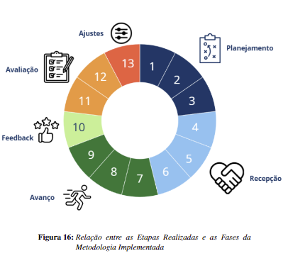
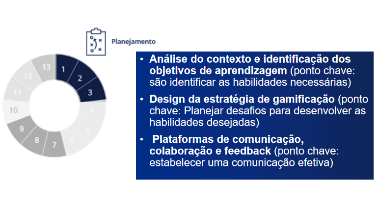
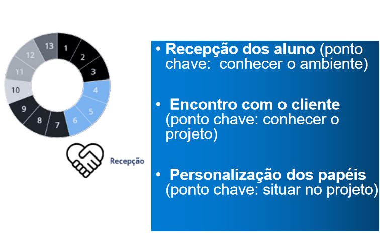
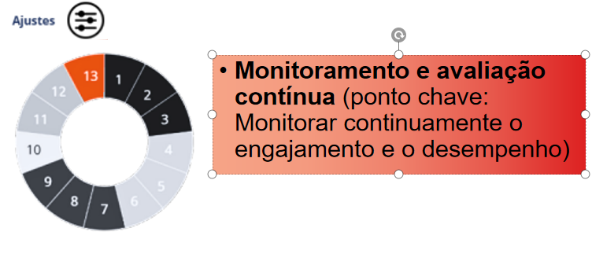
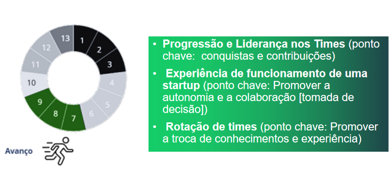
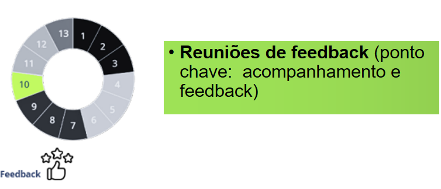
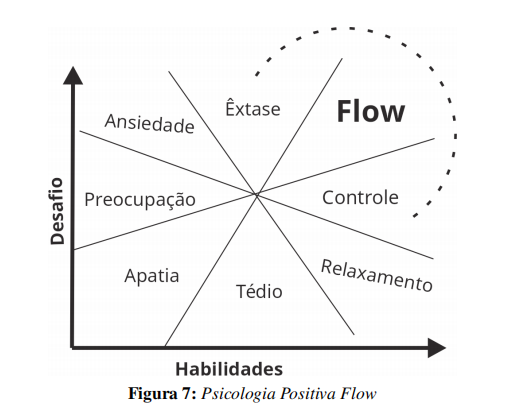
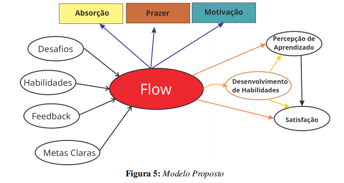

# Marcta Autonomy Framework (MAF)

## Introdução

O **Marcta Autonomy Framework (MAF)** é um modelo desenvolvido para abordar o desenvolvimento de habilidades pessoais e profissionais em ambientes educacionais e corporativos, por meio da gamificação. O MAF combina elementos de frameworks de gamificação, como **Octalysis** de Yu-kai Chou, **HEXAD** de Andrzej Marczewski, e a **Teoria da Autodeterminação** (SDT) de Deci e Ryan, buscando equilibrar motivadores intrínsecos e extrínsecos. O foco do MAF está em criar uma experiência envolvente e personalizada para estimular o engajamento e o aprendizado contínuo.

## Problema

O problema abordado pelo MAF é a **falta de uma abordagem integrada e personalizada** que equilibre os motivadores intrínsecos e extrínsecos de maneira eficaz, permitindo a medição precisa dos resultados tanto individuais quanto coletivos. Os frameworks de gamificação existentes apresentam limitações quanto à flexibilidade e à adequação a diferentes contextos educacionais, além da dificuldade de medir o impacto na motivação e no desenvolvimento de habilidades.

## Metodologia

A metodologia do MAF se baseia em **seis ciclos em 13 passos**, que visam proporcionar uma experiência contínua de desenvolvimento de habilidades. Abaixo estão as fases do framework ilustradas:

1. **Planejamento** 
2. **Recepção** 
3. **Ajuste** 
4. **Avanço** 
5. **Feedback** 

Essa estrutura possibilita uma aplicação flexível e adaptável em diferentes ambientes, sempre buscando maximizar o aprendizado e o engajamento dos participantes.

## Flow e Habilidades

O conceito de **Flow**, conforme definido por Mihaly Csikszentmihalyi, é central para entender o engajamento em atividades complexas e desafiadoras. No contexto do MAF, o Flow refere-se ao estado em que os participantes estão totalmente imersos nas atividades, encontrando um equilíbrio entre desafio e habilidades. Este estado é essencial para manter a motivação e o desenvolvimento contínuo.

A imagem acima mostra a relação entre o Flow e o desenvolvimento de habilidades no MAF. O objetivo é criar um ambiente que promova o estado de Flow nos participantes, incentivando o aprendizado ativo e contínuo.

## Estudos de Caso

O MAF foi aplicado em dois estudos de caso principais:

1. **Fábrica de Software**: A aplicação do MAF na disciplina de **Prática em Engenharia de Software** visou simular um ambiente profissional para alunos do curso, focando no desenvolvimento de habilidades como liderança, trabalho em equipe e resolução de problemas. Os resultados indicaram um aumento significativo no engajamento dos estudantes e no desenvolvimento das habilidades interpessoais.

2. **Introdução à Programação**: Outro estudo de caso foi realizado em turmas de **Introdução à Programação** para alunos do Bacharelado em Inteligência Artificial. A aplicação do MAF promoveu a motivação e a autonomia dos alunos, incentivando o aprendizado de habilidades técnicas e o desenvolvimento de competências sociais essenciais, como comunicação e colaboração.

## Conclusão

O **Marcta Autonomy Framework** apresenta-se como uma solução eficaz para o **design de experiências de aprendizado** que promovam o desenvolvimento de habilidades pessoais e profissionais, ao mesmo tempo em que aumentam o engajamento e a satisfação dos participantes. O uso de gamificação personalizada permite que o MAF seja adaptado a diferentes contextos, mantendo um foco contínuo no aprimoramento e na autonomia dos estudantes.

## Links para Documentos Relacionados

- [Análise de dados - Marcta.docx](./An%C3%A1lise%20de%20dados%20-%20Marcta.docx)
- [Projeto PTA BIA 2024 (1).pdf](./Projeto%20PTA%20BIA%202024%20(1).pdf)
- [Formulário de avaliação.docx](./formul%C3%A1rio%20de%20avaliacao.docx)
- [Links e informações.md](./links%20e%20informacoes.md)

- [Análise de dados - Marcta.docx](./An%C3%A1lise%20de%20dados%20-%20Marcta.docx)
- [Projeto PTA BIA 2024 (1).pdf](./Projeto%20PTA%20BIA%202024%20(1).pdf)
- [Formulário de avaliação.docx](./formul%C3%A1rio%20de%20avaliacao.docx)
- [Links e informações.md](./links%20e%20informacoes.md)
